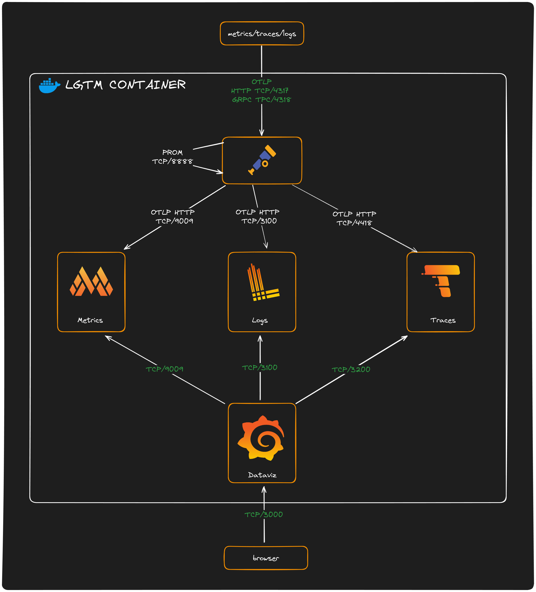

# docker-lgtm

An OpenTelemetry backend in a Docker image.



The `ghcr.io/david-guenault/docker-otel-lgtm` Docker image is an open source backend for OpenTelemetry that’s intended for development, demo, and testing environments. If you are looking for a production-ready, out-of-the box solution to monitor applications and minimize MTTR (mean time to resolution) with OpenTelemetry and Mimir, you should try [Grafana Cloud Application Observability](https://grafana.com/products/cloud/application-observability/).

Most of the work was done on the original repository at: https://github.com/grafana/docker-otel-lgtm. This fork just implement mimir in place of prometheus. 


## Run the container

```sh
make start
```

## Stop container

```sh
make stop
```

## Clean up

```sh
make clean
```

## build docker image

```sh
make build
```

You can customize image name in the Makefile. 

## exposed ports

|application|ports|description|exposed ?|
|---|---|---|---|
|tempo|TCP/4417|distributor receivers otlp grpc endpoint port|N|
|tempo|TCP/4418|distributor receivers otlp http endpoint port|N|
|tempo|TCP/3200|http listen port|Y|
|tempo|TCP/9096|grpc listen port|N|
|mimir|TCP/7946|ring memberlist port|N|
|mimir|TCP/9090|http listen port|Y|
|mimir|TCP/9091|grpc listen port|N|
|loki|TCP/3100|http listen port|Y|
|loki|TCP/9095||N|
|grafana|TCP/3000|grafana serveer http port|Y|
|opetelemetry collector|TCP/4317|receiver otlp grpc|Y|
|opetelemetry collector|TCP/4318|receiver otlp http|Y|
|opetelemetry collector|TCP/8888|service telemetry prometheus exporter|N|

## Send OpenTelemetry Data

There's no need to configure anything: The Docker image works with OpenTelemetry's defaults.

```sh
# Not needed as these are the defaults in OpenTelemetry:
export OTEL_EXPORTER_OTLP_PROTOCOL=grpc
export OTEL_EXPORTER_OTLP_ENDPOINT=http://localhost:4317
```

## View Grafana

Log in to [http://localhost:3000](http://localhost:3000) with user _admin_ and password _admin_.


## Build and run the example app

Run the example REST service:

```sh
# Unix/Linux
./run-example.sh
```

Generate traffic:

```sh
# Unix/Linux
./generate-traffic.sh
```

## Run example apps in different languages

The example apps are in the `examples/` directory.
Each example has a `run.sh` or `run.cmd` script to start the app.

Every example implements a rolldice service, which returns a random number between 1 and 6.

Each example uses a different application port (to be able to run all applications at the same time).

| Example | Service URL                           |
|---------|---------------------------------------|
| Java    | `curl http://localhost:8080/rolldice` |
| Go      | `curl http://localhost:8081/rolldice` |
| Python  | `curl http://localhost:8082/rolldice` |
| dotnet  | `curl http://localhost:8083/rolldice` |

## Related Work

* Metrics, Logs, Traces and Profiles in Grafana: <https://github.com/grafana/intro-to-mltp>
